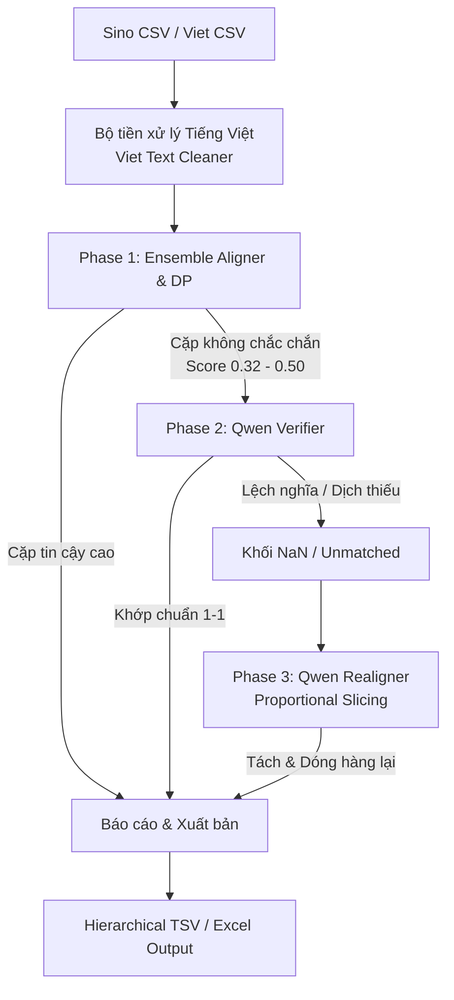

# Tài liệu Kỹ thuật: Hệ thống Dóng hàng Câu Song ngữ Hán-Việt Cổ
## (Sino-Vietnamese Sentence Alignment System)

Tài liệu này mô tả chi tiết kiến trúc, thuật toán và các bước xử lý của hệ thống dóng hàng câu tự động giữa văn bản **chữ Hán cổ** (trích xuất từ OCR của tác phẩm *Đại Nam Nhất Thống Chí*) và bản dịch **tiếng Việt quốc ngữ**.

Hệ thống được thiết kế tối ưu để xây dựng bộ dữ liệu dịch thuật song hành chất lượng cao (Gold Parallel Corpus), loại bỏ triệt để các thông tin nhiễu của dịch giả để phục vụ huấn luyện mô hình dịch máy (Machine Translation).

---

## 1. Sơ đồ Kiến trúc Tổng quan (Architecture)

Hệ thống hoạt động theo luồng xử lý khép kín gồm 4 tầng chính:



---

## 2. Chi tiết các Giai đoạn Xử lý

### 2.1. Tầng Tiền xử lý: Làm sạch văn bản Tiếng Việt (Viet Text Cleaner)
Để tránh hiện tượng vector nhúng bị méo do ký tự lạ và giảm thiểu việc mô hình LLM từ chối dóng hàng oan, văn bản tiếng Việt được làm sạch **ngay tại thời điểm nạp vào bộ nhớ (Load Time)**.

#### Các quy tắc dọn dẹp bằng Regular Expressions (Regex):
1. **Xóa năm dương lịch quy đổi:**
   - *Regex:* `r'\(\s*(?:năm\s+)?\d{4}(?:\s*-\s*\d{4})?\s*\)'`
   - *Ví dụ:* `năm Minh Mạng thứ 10 (1829)` $\rightarrow$ `năm Minh Mạng thứ 10`
2. **Xóa chỉ mục chú thích chân trang:**
   - *Regex:* `r'\(\s*\d+\s*\)'`
   - *Ví dụ:* `Kinh-thành (1) đắp đất` $\rightarrow$ `Kinh-thành đắp đất`
3. **Xóa toàn bộ ký tự Hán cổ kẹp dòng của dịch giả:**
   - *Regex:* `r'[\u4e00-\u9fff\u3400-\u4dbf\uf900-\ufaff]+(?:\s*[,;，；、]\s*)?'`
   - *Ví dụ:* `cửa Thề nhơn 體仁:` $\rightarrow$ `cửa Thề nhơn:`
4. **Xóa chú thích ngắn của dịch giả trong ngoặc đơn ($\le$ 15 ký tự):**
   - *Logic:* Sử dụng bộ đếm ký tự trong nhóm bắt giữ `([^)]+)`. Nếu chiều dài $\le 15$, xóa toàn bộ ngoặc đơn.
   - *Ví dụ:* `phương-đường (nhà vuông)` $\rightarrow$ `phương-đường` (Xóa vì `nhà vuông` có 8 ký tự).
   - *Ngoại lệ:* `Trà-bát (thuộc huyện Đăng-xương Quảng-Trị lại dời qua...)` $\rightarrow$ Giữ nguyên vì cụm trong ngoặc dài hơn 15 ký tự, chứa thông tin cú pháp quan trọng của câu.
5. **Chuẩn hóa khoảng trắng và dấu câu:**
   - Dọn sạch các lỗi dấu câu kép do quá trình xóa để lại (như `,,`, `, .`, khoảng trắng trước dấu chấm phẩy).

---

## 3. Phase 1: Multi-Scorer Ensemble & Quy hoạch động (DP)

Tầng dóng hàng thô sử dụng tổ hợp 4 bộ chấm điểm (Scorers) để xây dựng ma trận độ tương đồng ngữ nghĩa:

| Bộ chấm điểm (Scorer) | Mô hình sử dụng | Đặc trưng tính toán | Trọng số ($W$) |
| :--- | :--- | :--- | :--- |
| **LaBSE Scorer** | `sentence-transformers/LaBSE` | Cosine similarity của câu nguồn và câu đích. | **0.40** |
| **Vecalign Scorer** | `sentence-transformers/LaBSE` | Tính toán trung bình trượt của các câu lân cận (cửa sổ $W=3$) để nắm bắt ngữ cảnh đoạn văn. | **0.30** |
| **BERTAlign Scorer** | `paraphrase-multilingual-MiniLM-L12-v2` | Cung cấp tín hiệu đa dạng từ một kiến trúc mô hình khác biệt. | **0.15** |
| **SimAlign Scorer** | `xlm-roberta-base` | Khớp từ vựng mức độ thưa (Sparse Word Alignment) cho top-5 câu ứng viên tiềm năng nhất. | **0.15** |

#### Thuật toán Fuse Trọng số Động (Sparse Weight Redistribution):
Vì ma trận SimAlign là ma trận thưa (chỉ tính cho top-5), tại các ô $(i,j)$ mà SimAlign có điểm số bằng $0$, hệ thống tự động phân bổ lại trọng số $0.15$ của SimAlign cho 3 bộ scorers còn lại theo tỷ lệ thuận để tránh làm giảm điểm tương đồng oan của cặp câu.

#### Quy hoạch động (Dynamic Programming):
Dựa trên ma trận điểm cuối cùng, thuật toán DP tìm đường đi tối ưu nhất với các ràng buộc kích thước ghép câu:
- `max_merge_han = 15`: Cho phép ghép tối đa 15 câu chữ Hán (để đối phó với hiện tượng ngắt dòng lỗi trong OCR Hán).
- `max_merge_viet = 2`: Giới hạn ghép tối đa 2 câu tiếng Việt.
- Ngưỡng cắt dứt điểm (Threshold): `0.32`. Các cặp có score dưới `0.32` sẽ bị tách thành các câu đơn và đánh dấu khuyết (`NaN`).

---

## 4. Phase 2: Xác thực bằng mô hình ngôn ngữ lớn (Qwen Verifier)

Các cặp dóng hàng có điểm số nằm trong vùng không chắc chắn **`[0.32, 0.50]`** sẽ được gửi tới mô hình offline `Qwen2.5-7B-Instruct` để xác thực lại.

#### Tiêu chuẩn Chấm điểm & Lọc của Qwen:
Mô hình Qwen được cấu hình với prompt nghiêm ngặt nhằm hướng tới mục tiêu xây dựng **Gold Parallel Dataset (Khớp thông tin 1-1 trực tiếp, không chứa chú thích dịch giả hay tóm tắt dịch thiếu)**:
- **Điểm 5:** Dịch chính xác, đầy đủ nghĩa, khớp thông tin trực tiếp 1-1, không có chú thích dịch giả thêm.
- **Điểm 4:** Dịch đúng thông tin cốt lõi, có thể lệch một vài trợ từ không quan trọng.
- **Điểm 3:** Dịch đúng nhưng tiếng Việt chứa thông tin thừa do dịch giả **chú thích thêm trong ngoặc đơn** mà bản Hán không có.
- **Điểm 2:** Dịch thiếu rất nhiều thông tin cốt lõi, hoặc chứa quá nhiều văn bản diễn giải dài dòng của dịch giả.
- **Điểm 1/0:** Lệch nghĩa hoàn toàn.

#### Cơ chế Lọc (Keep/Reject Threshold):
- Hệ thống thiết lập **`keep_threshold = 4`** trong `config.py`.
- Toàn bộ các câu bị chấm **điểm 3 trở xuống sẽ bị hệ thống loại bỏ thẳng tay** (split thành các dòng khuyết NaN để lọc bỏ ở bước cuối). Chỉ giữ lại các câu đạt điểm 4 và 5 sạch sẽ.
- Trình parser phản hồi của Qwen được tối ưu hóa để ưu tiên bóc tách các chữ số nằm ngay đầu chuỗi trả về để tránh nhận diện sai các chữ số phụ trong phần diễn giải của mô hình.

---

## 5. Phase 3: Dóng hàng cục bộ cụm NaN (Qwen Realigner)

Sau Phase 2, các câu bị loại bỏ hoặc không thể dóng hàng tự động ở Phase 1 sẽ gom lại thành các cụm câu khuyết liền kề (NaN Clusters). Nếu một cụm NaN chứa cả câu Hán và câu Việt, Phase 3 sẽ gọi Qwen để dóng hàng lại cục bộ.

#### Thuật toán Phân tách Cụm tỷ lệ (Proportional Cluster Slicing):
Để giải quyết triệt để lỗi tràn bộ nhớ card đồ họa (**CUDA Out of Memory**) khi gặp cụm NaN quá lớn (ví dụ: khối nghẽn chứa 226 câu Hán và 29 câu Việt):
1. **Kiểm tra kích thước:** Nếu số câu Hán hoặc Việt của cụm vượt quá `12`, thuật toán phân tách sẽ được kích hoạt.
2. **Tính toán bước nhảy:** Xác định số lượng mảnh cắt `num_chunks = ceil(max_len / 12)`. Tính toán bước nhảy Hán (`h_step`) và Việt (`v_step`) tương ứng theo tỷ lệ số câu của cụm gốc.
3. **Băm khối tuần tự:** Cắt cụm lớn thành các khối con độc lập có kích thước nhỏ gọn (tối đa 12 câu Hán/Việt trên một khối).
4. **Xử lý tuần tự và Cô lập lỗi:** 
   - Gửi từng khối con cho Qwen để xử lý dóng hàng.
   - Nếu bất kỳ khối con nào gặp lỗi hoặc bị tràn VRAM, hệ thống sẽ **cô lập khối con đó** (giữ nguyên trạng thái NaN cho các câu trong khối đó), các khối con chạy thành công khác vẫn sẽ được dóng hàng và cứu dữ liệu bình thường, không gây ảnh hưởng đến toàn bộ cụm lớn.

---

## 6. Định dạng Dữ liệu Đầu vào & Đầu ra (I/O Specification)

### 6.1. Dữ liệu Đầu vào (Inputs)
* **Bản Hán cổ (Sino CSV):**
  - Do lỗi trích xuất OCR chứa nhiều dấu phẩy không đóng ngoặc kép, hệ thống sử dụng hàm tự định nghĩa `load_sino_csv(file_path)` thay vì `pd.read_csv`.
  - Cấu trúc bắt buộc gồm 3 cột: `ID` (Mã định danh câu), `sentence` (Nội dung chữ Hán), và `reference_Id` (Thông tin tham chiếu dạng JSON).
* **Bản tiếng Việt (Viet CSV):**
  - Tệp CSV chứa cột `sentence` đại diện cho các câu tiếng Việt dịch nghĩa tương ứng.

### 6.2. Dữ liệu Đầu ra (Outputs)
Sau khi kết thúc quy trình, dữ liệu được ghi dưới dạng thư mục phân cấp phục vụ huấn luyện:
- Tệp TSV (`_parallel.tsv`): Định dạng phân tách bằng tab gồm 3 cột chuẩn `pair_id \t han_sentence \t viet_sentence`.
- Tệp Excel (`_parallel.xlsx`): Chứa thêm cột `similarity_score` để phục vụ công tác kiểm tra thủ công.

---

## 7. Hướng dẫn vận hành trên Kaggle (Execution Guide)

Hệ thống được thiết kế để chạy mượt mà trên môi trường **Kaggle Notebook sử dụng GPU T4 x2 (hoặc T4 x1)**.

### Bước 1: Kích hoạt môi trường và tải mã nguồn
Đảm bảo bạn đang sử dụng môi trường Conda Python 3.10:
```bash
conda activate py310
```

### Bước 2: Chạy toàn bộ tiến trình dóng hàng
Sử dụng tham số `--qwen` để chạy bộ xác thực lọc chú thích (Phase 2) và `--realign` để chạy cứu dữ liệu cụm NaN (Phase 3):
```bash
python run_mapping.py \
  --sino_dir "dataset/MAPPING/sino_extract" \
  --viet_dir "dataset/MAPPING/vietnam_extract/csv" \
  --work_code "HVB_001" \
  --output_dir "output" \
  --qwen \
  --realign
```

*Lưu ý:* Hệ thống sẽ tự động in log trực quan mẫu làm sạch văn bản `[Cleaner Log]` và quá trình băm khối của Qwen `[QwenRealign]` trực tiếp trên màn hình console để bạn kiểm duyệt.
